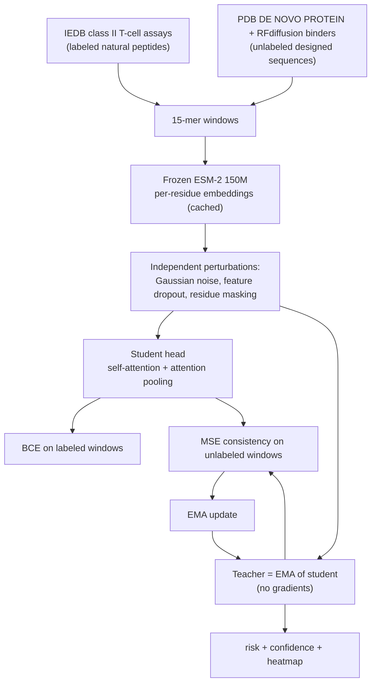

# Semi-supervised immunogenicity model for de novo binders

Predicts MHC class II (CD4 T-cell) immunogenicity risk for designed proteins, and
adapts to the de novo distribution using **unlabeled** designed sequences.

Three outputs per binder: a **risk score**, a **decomposed confidence score**, and a
**per-residue heatmap** showing which stretches drive the risk.

## The problem

Every public immunogenicity predictor is trained on natural proteins — peptides from
human, bacterial and viral proteomes, assayed in IEDB. De novo binders (RFdiffusion,
ProteinMPNN, Rosetta) do not look like anything in those training sets. The model is
therefore extrapolating, and it has no way to say so.

We have plenty of unlabeled de novo sequences and zero de novo immunogenicity labels.
That is exactly the setting semi-supervised learning is for.

## Approach



**No pseudo-labels, no external distillation.** The teacher is an exponential moving
average of the student's own weights. Unlabeled de novo windows contribute exactly one
requirement: the model must answer the same window the same way under two different
perturbations. No label is ever invented for them, and no other predictor
(NetMHCIIpan, MHCflurry, …) is imitated.

### Why the encoder is frozen

ESM-2 150M runs once over the corpus and the embeddings are cached to disk. Only a
726k-parameter head trains, so a full Mean Teacher run takes minutes on a laptop and
every experiment is a fair rerun of the same setup.

### Prediction unit

Isolated 15-mers. Class II assays are run on synthetic peptides, so embedding each
window on its own — rather than slicing it out of a whole-protein embedding — keeps
training and inference on identical footing.

## Data

| Set | Source | Size |
| --- | --- | --- |
| Labeled natural | IEDB `tcell_full_v3`, class II + human host, Positive/Negative | 147,792 unique 15-mers, 46% positive, 10,933 source-protein groups |
| Unlabeled de novo | PDB entities keyed `DE NOVO PROTEIN` + 95 RFdiffusion IL-7Ra minibinders | 75,310 windows from 1,458 designs |
| Natural reference | UniProt reviewed human / E. coli / M. tuberculosis, whole proteins | 39,857 windows from 360 proteins |

A peptide is labeled immunogenic if it ever drove a positive T-cell response; a
negative only says "not in this donor set". Splits are **grouped by source protein**,
so overlapping peptides from one antigen cannot straddle train and test.

## The three outputs

**Risk score.** Per-window probabilities are collapsed to disjoint candidate epitope
regions by greedy non-maximum suppression, then combined with a noisy-or. Combining
stride-1 windows directly would saturate every protein at 1.0, because neighbouring
windows are near-duplicates rather than independent tests. Reported alongside a
**length-matched percentile** against the natural cohort (noisy-or grows with length,
so a 90-residue binder must not be compared against 400-residue proteins) and a
length-independent **peak window risk**.

**Confidence**, decomposed rather than a single opaque number:

- *stability* — spread of MC-dropout samples
- *agreement* — student vs EMA teacher
- *familiarity* — kNN distance in ESM-2 space to the labeled training peptides

Familiarity is the one that matters for de novo work: it is how the model reports
"this sequence is unlike anything I was trained on" instead of quietly extrapolating.

**Heatmap.** Pooling attention scaled by each window's risk and scattered back onto the
sequence, cross-checked against integrated gradients. Attention says where the model
looked; integrated gradients say what moved the logit. A hotspot both agree on is
stronger evidence than one only a single method supports.

## Validation

There are no de novo immunogenicity labels, so the claim is supported where ground
truth exists, and reported descriptively where it does not. Every comparison holds
architecture, seed, step count and augmentation fixed, and **both arms keep an EMA
teacher** — so the only moving part is the consistency term over unlabeled windows.

1. **In-distribution preservation** — does adding unlabeled de novo data harm natural performance?
2. **Label-fraction** — hide 80–95% of IEDB labels, feed them back unlabeled. Ground truth is known, so the gain is measurable.
3. **Organism holdout** — train on some source organisms, adapt to a held-out one with its labels hidden. The closest labeled analogue of the natural-to-designed shift.
4. **De novo behaviour** — robustness under perturbation, predictive entropy, and the measured OOD gap on real designed sequences.
5. **Epitope recovery** — per-antigen AUC over held-out antigens: does the risk actually localize real epitopes?

## What the attention is, and what it is not

`scripts/anchor_check.py` asks whether the head rediscovered class II binding chemistry.
Two checks, 20,000 held-out windows, and the honest answer is mixed:

**Attention does not track P1 anchors.** Large hydrophobics (FWYLIVM) receive *less*
pooling attention than average (ratio 0.69) while other residues receive more (1.17);
the most-attended residue is cysteine at 2.7x. So the heatmap should be read as *where
the model aggregated evidence*, not as a predicted binding register. This is not
surprising — ESM-2 embeddings are contextual, so the embedding at one position already
carries its neighbours and attention need not point at the contact residue — but it
does mean the attention track alone should not be presented as an epitope core.

**Predicted risk does reproduce the direction of the real compositional trends.**

| | model risk | true IEDB label |
| --- | --- | --- |
| vs hydrophobic fraction | r = −0.198 | r = −0.056 |
| vs aromatic fraction | r = +0.158 | r = +0.051 |

Same sign in both cases, so the model is not inverting the biology, but the correlations
are roughly 3x stronger than in the labels — the head leans on bulk composition harder
than the data justifies. Worth knowing before trusting a single window in isolation.
(Note the negative hydrophobic correlation is a property of this IEDB class II slice,
not the textbook expectation; assayed epitopes skew toward soluble peptides.)

This is why the region call and the integrated-gradients cross-check exist, and why the
figure reports peak window risk next to the aggregate.

## Running it

```bash
uv sync --extra ml

uv run python -m re_agent.immuno.data      # build datasets (downloads IEDB, PDB, UniProt)
uv run python -m re_agent.immuno.embed     # cache ESM-2 embeddings (~15 min on MPS)
uv run python -m re_agent.immuno.train     # baseline + mean teacher
uv run python -m re_agent.immuno.validate  # all five experiments
uv run python -m re_agent.immuno.figures   # summary figures

# assess a binder
uv run python -m re_agent.immuno.report data/raw/demo_binders.fasta
uv run python -m re_agent.immuno.report MKRNYILGLDIGITSVGYGIID --name my_design
```

Pipeline readiness: `uv run python scripts/check_setup.py --immuno`.

## Limitations

- Class II / CD4 only. Class I (CD8) is a separate pathway and is not modeled.
- Allele-agnostic: predicts "does this peptide elicit a human T-cell response", not
  per-HLA-DRB1 restriction. Allele conditioning would need the allele as a model input.
- IEDB negatives are "not observed in the tested donors", not proof of non-immunogenicity.
- The de novo pool is crystallized designs plus one binder campaign; it is a proxy for,
  not a census of, the designed-protein distribution.
- The SaCas9 epitope set of Simhadri 2021 is not curated in this IEDB snapshot, so
  epitope recovery is measured across many held-out IEDB antigens instead of that
  single case study. SaCas9 is still scored as a demo input.
